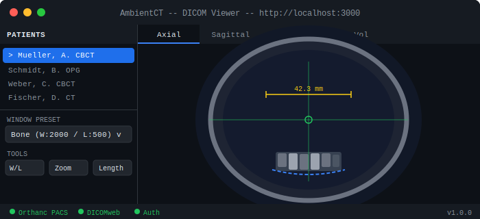

<div align="center">

# 🦷 AmbientCT

**Your practice PACS in a box — zero license fees, zero cloud dependency, one command.**

[](https://github.com/Ambientwork/AmbientCT)
[](LICENSE)
[](https://github.com/Ambientwork/AmbientCT/stargazers)

A free, open-source DICOM viewer for dental and medical practices.
View CBCT, CT, MRI, OPG and all DICOM formats in your browser —
with 3D volume rendering, MPR, and measurement tools.

</div>

> A dentist built a full PACS server with zero programming background — using AI coding tools.
> One Docker command. Zero license fees. Patient data stays on your hardware.

---

## Interface

<div align="center">

</div>

---

## Quick Start

```bash
git clone https://github.com/Ambientwork/AmbientCT.git && cd AmbientCT
cp .env.example .env          # Edit credentials before going live
docker compose up -d
```

Open **http://localhost:3000** — your PACS is running.

---

## Features

- 🏥 **Full PACS Server** — Orthanc with DICOMweb, C-STORE, and WADO support
- 🧠 **3D Volume Rendering** — Axial, sagittal, and coronal MPR via Cornerstone3D
- 🦷 **Dental Presets** — Optimized Window/Level for bone, implants, soft tissue, and mandibular canal
- 📦 **One Command Deploy** — Docker Compose, runs on Mac, Linux, and Windows
- 🔒 **Privacy First** — Fully on-premise, no cloud, no tracking, DSGVO-ready
- 📂 **Any DICOM Source** — Drag & drop files or receive from any DICOM device via DIMSE
- 🛠️ **Zero Config** — Sane defaults out of the box, `.env` for overrides
- 🆓 **Free Forever** — MIT license, no vendor lock-in

---

## Architecture

```
Browser → Nginx :443 → AmbientCT Viewer :3000   (React + WebGL, built on OHIF)
                     → Orthanc :8042        (DICOMweb REST API)
                     → Orthanc :4242        (DICOM DIMSE, LAN only)

Storage: Orthanc → SQLite + filesystem (./data/orthanc-db/)
```

| Component | Version | Role |
|-----------|---------|------|
| [Orthanc](https://www.orthanc-server.com/) | 24.12.2 | PACS server, DICOMweb, DIMSE |
| [AmbientCT Viewer](https://github.com/Ambientwork/AmbientCT) | v0.2.0 | Web imaging frontend, built on OHIF v3.9.2 |
| [Cornerstone3D](https://www.cornerstonejs.org/) | latest | 3D rendering engine |
| Nginx | latest | Reverse proxy |

---

## AI Assist (research preview)

AmbientCT ships an early-stage **AI Assist** layer for dental CBCT review. It is a foundation, not a product feature: the data model, panel UI, and inference adapter are in place, backed by a local browser-side mock with clearly marked demo data. No image, header, or log ever leaves your machine.

| What works today | What is intentionally mocked |
|------------------|------------------------------|
| Typed data model for jobs, findings, anatomy segmentations | Real model inference (no weights downloaded) |
| Findings store with reviewer state (accept / reject / edited) | Out-of-distribution detection (placeholder only) |
| AI Assist right-panel with confidence + uncertainty display | Persistence to Orthanc metadata (in-memory + localStorage only) |
| Adapter API mirroring the planned local FastAPI service shape | Audit-log persistence (logged in-browser only) |

Every suggestion is labeled **"Research Preview · Demo Data · Not for Diagnosis"** and requires clinician confirmation. The first real model integration target is mandibular-canal anatomy segmentation, following the [DentalSegmentator](https://github.com/gaudot/SlicerDentalSegmentator) and [MONAI Label](https://monai.io/label.html) approach. See [`docs/AI-ASSIST-ARCHITECTURE.md`](docs/AI-ASSIST-ARCHITECTURE.md) for the phased roadmap and risk controls, and [`docs/DENTAL-FEATURES-ROADMAP.md`](docs/DENTAL-FEATURES-ROADMAP.md) for the broader feature plan.

---

## Documentation

- [Setup Guide](docs/SETUP-GUIDE.md)
- [Architecture Decisions](docs/ARCHITECTURE.md)
- [AI Assist Architecture](docs/AI-ASSIST-ARCHITECTURE.md)
- [Dental Features Roadmap](docs/DENTAL-FEATURES-ROADMAP.md)
- [Troubleshooting](docs/TROUBLESHOOTING.md)
- [Third-Party Notices](THIRD_PARTY_NOTICES.md)

---

## Disclaimer

AmbientCT is **not FDA- or CE-certified**. It is intended for informational and workflow purposes only. Clinical diagnostic decisions must be made by licensed healthcare professionals using certified software. The AI Assist layer is a research preview and does not perform autonomous diagnosis.

---

## Story

Built by a dentist using AI-powered development tools (Claude Code + Conductor) as a showcase for what non-programmers can build with modern AI tooling. [Read the full story →](#)

---

<div align="center">

**By [Ambientwork](https://ambientwork.ai)** — the better OS for dental practices.

MIT License · Made with 🤖 and ☕

</div>
